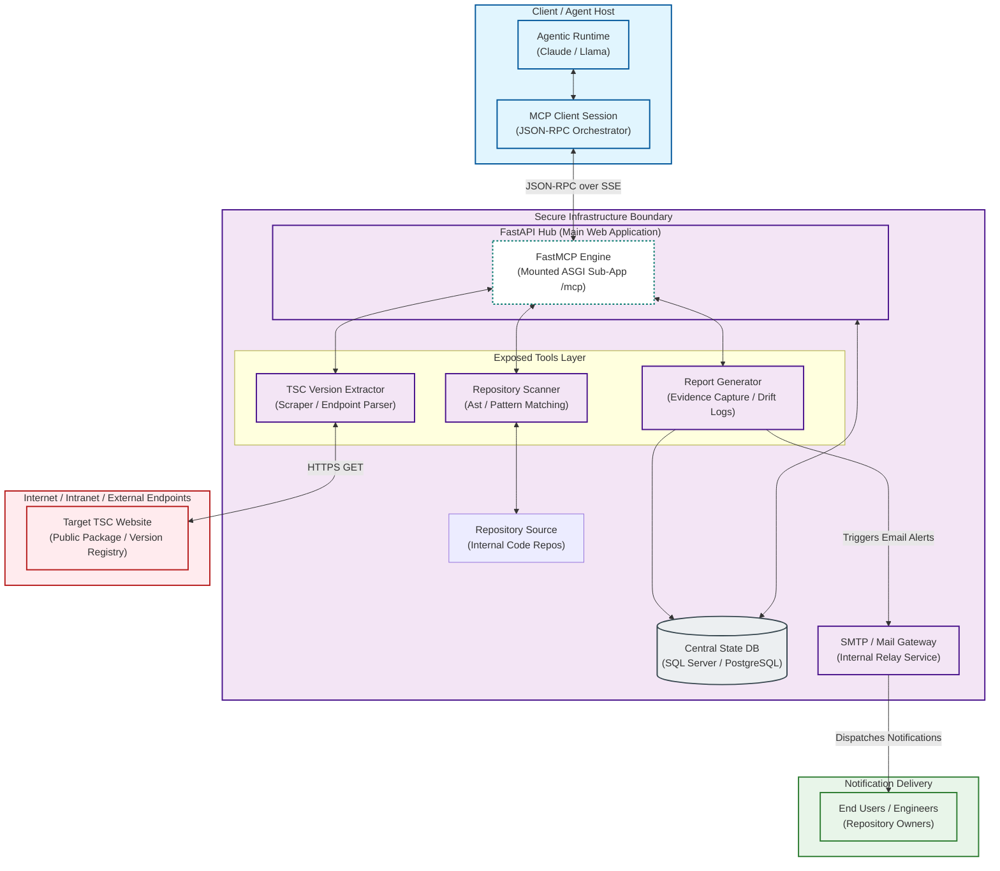

# MCP Repository Scanner Architecture

```mermaid
graph TD
    %% Styling Classes
    classDef client fill:#e1f5fe,stroke:#01579b,stroke-width:2px;
    classDef protocol fill:#fff3e0,stroke:#e65100,stroke-width:2px,stroke-dasharray: 5 5;
    classDef enterprise fill:#f3e5f5,stroke:#4a148c,stroke-width:2px;
    classDef public fill:#ffebee,stroke:#b71c1c,stroke-width:2px;
    classDef storage fill:#eceff1,stroke:#37474f,stroke-width:2px;
    classDef nested fill:#ffffff,stroke:#00796b,stroke-width:2px,stroke-dasharray: 3 3;
    classDef users fill:#e8f5e9,stroke:#2e7d32,stroke-width:2px;

    %% Client Host Domain
    subgraph Client_Host ["Client / Agent Host"]
        LLM["Agentic Runtime<br>(Claude / Llama)"]
        MCP_Client["MCP Client Session<br>(JSON-RPC Orchestrator)"]
        LLM <--> MCP_Client
    end
    class Client_Host,LLM,MCP_Client client;

    %% Protocol Boundary
    MCP_Client <--> |"JSON-RPC over SSE"| FastMCP_App

    %% Secure Enterprise Network Domain
    subgraph Enterprise_Network ["Secure Infrastructure Boundary"]
        
        %% FastAPI Parent with FastMCP Nested Inside
        subgraph FastAPI_Parent ["FastAPI Hub (Main Web Application)"]
            FastMCP_App["FastMCP Engine<br>(Mounted ASGI Sub-App /mcp)"]
        end
        style FastAPI_Parent fill:#f3e5f5,stroke:#4a148c,stroke-width:2px;
        class FastMCP_App nested;
        
        subgraph Specialized_Tools ["Exposed Tools Layer"]
            Scanner["Repository Scanner<br>(Ast / Pattern Matching)"]
            Extractor["TSC Version Extractor<br>(Scraper / Endpoint Parser)"]
            Reporter["Report Generator<br>(Evidence Capture / Drift Logs)"]
        end

        DB[("Central State DB<br>(SQL Server / PostgreSQL)")]
        Repo_Source["Repository Source<br>(Internal Code Repos)"]
        SMTP_Gate["SMTP / Mail Gateway<br>(Internal Relay Service)"]

        %% Inner Network Routing
        FastMCP_App <--> Scanner
        FastMCP_App <--> Extractor
        FastMCP_App <--> Reporter
        
        Scanner <--> Repo_Source
        FastAPI_Parent <--> DB
        Reporter ---> DB
        Reporter ---> |"Triggers Email Alerts"| SMTP_Gate
    end
    class Enterprise_Network,Scanner,Extractor,Reporter,SMTP_Gate enterprise;
    class DB storage;

    %% External Infrastructure & Users
    subgraph Public_Internet ["Internet / Intranet / External Endpoints"]
        TSC_Site["Target TSC Website<br>(Public Package / Version Registry)"]
    end
    
    subgraph Operations ["Notification Delivery"]
        End_Users["End Users / Engineers<br>(Repository Owners)"]
    end
    class Public_Internet,TSC_Site public;
    class Operations,End_Users users;

    %% Cross-Boundary Connections
    Extractor <--> |"HTTPS GET"| TSC_Site
    SMTP_Gate ---> |"Dispatches Notifications"| End_Users
```
